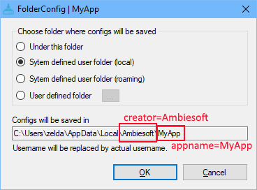

# FolderConfig
FolderConfig can make a user of the application choose a folder they want to save app's settings. Application creator does not need to think about where settings are to be saved.

# Download
Download binaries from https://github.com/erasoni/FolderConfig/releases.

# How to deploy
* Extract *FolderConfig-x.x.exe* to your application folder. Place *FolderConfig.exe* in the same directory of your application's main executable resides.
* Rename *FolderConfig.ini.sample* to *FolderConfig.ini* and edit it. 

## FolderConfig.ini
This file holds default values. Application creator should completes this file in accordance with its traits. It should not be editted during runtime of the application. *FolderConfig.ini* looks like follows.

```ini
[Main]
appname=MyApp
creator=Ambiesoft
defaultpathtype=0
defaultpath0=conf
```

If you lanuch *FolderConfig.exe* with *FolderConfig.ini* above, you will see follwing the setting dialog.




After the dialog was closed with *OK*, a file *folder.ini* will be created or written. 

## folder.ini
The application should read this file at the startup to decide the path to place setting files. It looks like follows.
```ini
[Main]
PathType=1

[TestWrite]
TID=291652156
```
*PathType=1* means the user choose *System defined user folder (local)*, the application can read this value by calling defined in *Ambiesoft.FolderConfigHelper.dll*, or call win32's *GetPrivateProfileString()*. In latter case, you must be careful for character encoding, *folder.ini* is encoded in UTF8 but win32api does not.
